# CLI-Design

> A production-grade agent skill for designing terminal surfaces that are accurate first,
> human-usable second, script/agent-usable third, and visually calm last.

**English** · [中文](./README.zh.md) · Version `2.0.4`

This skill is for terminal surfaces: what a CLI prints, how a TUI behaves, how color and
symbols carry state, how progress and errors recover, how output degrades in pipes and CI,
and how an agent-chat terminal UI renders turns, tools, approvals, choices, artifacts,
background work, and machine events.

It does not design command names, flags, business logic, or low-level terminal input loops.

## Install

```bash
npx skills add Mai8304/skills -s CLI-Design -g -y
```

Manual install:

```bash
git clone https://github.com/Mai8304/skills
cp -r skills/CLI-Design ~/.codex/skills/cli-design
```

Then ask your agent to use `cli-design` when designing, building, reviewing, or improving
CLI and terminal TUI output.

## What it helps with

CLI-Design helps agents turn terminal output into production-grade UI/UX, not just prettier
logs. It is useful when you need to:

- make command output easy for people to scan: result, blocker, scope, evidence, and next
  action are visible without reading every line
- keep machine contracts clean: `stdout` carries data, `stderr` carries conversation, and
  `--json`/NDJSON stay free of ANSI, spinners, prose wrappers, and decorative frames
- design terminal interaction: prompts, pickers, multi-select, approvals, key hints,
  cancellation, disabled states, dangerous actions, and non-TTY fallback
- make Agent Chat TUI understandable: transcript roles, live input drafts, streaming/final
  states, observable thinking summaries, tool calls/results, code blocks, file trees,
  diffs, approvals, artifacts, background tasks, and event fallbacks
- keep visual language consistent: semantic colors, symbols, spacing, borders, density,
  alignment, light/dark themes, `NO_COLOR`, `TERM=dumb`, narrow width, and CJK/wide text
- make failures production-ready: real cause, affected object, impact, recovery path,
  redaction, safe defaults, and stable exit behavior

The goal is not a house style. A quiet CI command, a dense table browser, and an agent-chat
terminal can look different. They should still share the same discipline: true state, clear
human action, clean machine output, and visual meaning that survives without color or
animation.

## How it works

The skill uses a routing workflow instead of a fixed template:

1. **Identify the reader and job.** Is this for a human, script, AI agent, operator, or
   mixed audience? Are they trying to inspect, act, recover, automate, or converse?
2. **Choose the surface family.** Route the work to Batch CLI, Interactive TUI, Agent Chat
   Terminal UI, or Machine-readable output before choosing layout or color.
3. **Define the contract.** Decide stdout/stderr, exit code, schema, event stream, prompt
   behavior, approval default, terminal state, fallback format, and redaction rules.
4. **Shape the information.** Put result, cause, scope, evidence, next step, rows, choices,
   transcript atoms, code, diffs, logs, and artifacts in the order the reader needs them.
5. **Apply visual semantics.** Use color, symbols, borders, spacing, and density only after
   the state roles are clear: success, warning, error, running, info, neutral, attention,
   cancelled, focus, selected, disabled, danger, and next action.
6. **Check degradation and safety.** Verify pipe, CI, `NO_COLOR`, `FORCE_COLOR`,
   `TERM=dumb`, narrow width, Unicode fallback, CJK/wide-character alignment, secret
   redaction, and destructive-action defaults.

Every decision follows the same priority order: **accurate first, human-usable second,
agent/script-usable third, visually calm last**. A pretty panel never justifies a wrong
state, an unclear recovery path, or a polluted machine contract.

## What the skill covers

| Area | Coverage |
|---|---|
| Surface routing | Batch CLI, Interactive TUI, Agent Chat Terminal UI, Machine-readable output |
| Batch CLI output | command results, help/usage, argument errors, diagnostics, progress, logs, summaries, tables, dry-runs, destructive previews, pipe/CI behavior |
| Interactive TUI | pickers, multi-select, forms, table/list browsers, pagers, code/log blocks, diffs, approvals, completion menus, live progress |
| Agent Chat Terminal UI | transcript roles, input draft, streaming/final states, tools, approvals, choices, artifacts, interrupts, queues, background work, replay, event fallback |
| Machine-readable output | `--json`, NDJSON, pipe/plain output, stdout/stderr, exit codes, schemas, stable enums, structured errors, versioning |
| Visual language | semantic roles, theme tokens, status colors/symbols, focus/selection/input/disabled/danger, density, borders, table/code/diff/log visuals |
| Runtime robustness | `NO_COLOR`, `FORCE_COLOR`, `TERM=dumb`, CI, non-TTY, narrow width, CJK/wide-character alignment, ASCII fallback, terminal cleanup |
| Safety and trust | destructive confirmation, approval state, redaction, secret handling, audit-friendly tool output, recovery copy |

## Before / after: CLI and Interactive TUI

The README shows representative cases. Each image is a before/after comparison with English
terminal text. The code blocks show the same failure mode in plain text; the image shows one
possible rendering. Examples are recipes, not templates: preserve the information contract
and adapt layout, density, and voice to the CLI in front of you.

### 1. Errors That Guide

**Before**

```text
Error: invalid
Error: failed
```

**After**

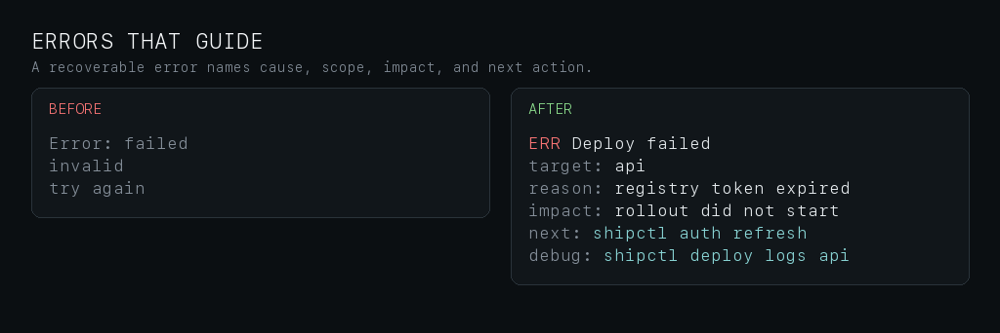

An error is not just red text. It must name the operation, cause, affected scope, impact,
and a concrete recovery step when knowable.

### 2. Semantic Color, Progress, and Result State

**Before**

```text
Deploying...
Still working...
Done, but some things failed.
Lots of log output...
```

**After**

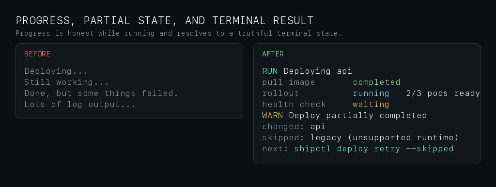

Use color for semantic state only after the text names the state. Green can reinforce
completed work, yellow can reinforce warning, waiting, skipped, or partial states, red can
reinforce actual failure, and cyan can reinforce the current operation or next action.
Progress must be honest while running and must resolve to a truthful terminal state.

### 3. Data Shapes and Diagnostics

**Before**

```text
ID TITLE AUTHOR BRANCH CHECKS FILES
128 Fix color fallback open zw fix-color->main pass=4 files=6
error config bad
line 14 column 9
```

**After**

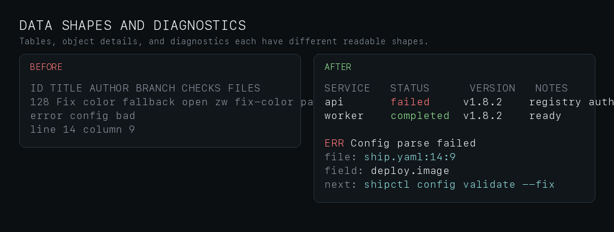

Use tables for homogeneous rows, key-value blocks for one object, and diagnostics for
source, cause, evidence, and next action. Do not squeeze long paths or errors into table
cells. Alignment must use display width, not byte or rune count.

### 4. Runtime Contracts and Redaction

**Before**

```text
Deploying api...
{ "status": "\x1b[31mfail\x1b[0m" }
Try logging in again!
token: sk-live-123456
Done!
```

**After**

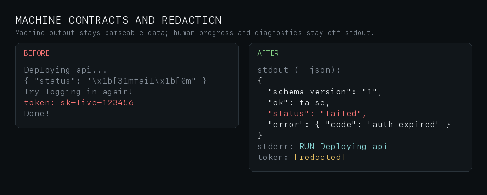

Machine mode is a contract. Human progress and diagnostics stay off stdout, and `--json` or
NDJSON stays parseable even when color is forced. Secrets must be redacted in human output,
logs, transcripts, fixtures, screenshots, and machine events.

### 5. Content Blocks, File Trees, Diff, and Logs

**Before**

```text
FILES src main go internal deploy go README md
config line 14 image missing
- old image registry/app:old
+ new image registry/app:new
2026-07-02 INFO ok WARN slow ERROR failed
```

**After**

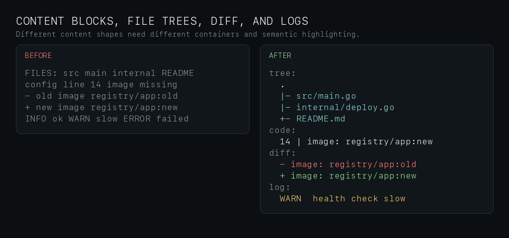

Code, file trees, diffs, and logs are different content shapes. They need different
containers, stable copy/paste text, semantic highlighting, truncation rules, and artifact or
pager fallback for large output.

### 6. Multi-select and Safe Confirmation

**Before**

```text
Restart services? y/n
1 api
2 worker
3 legacy
DELETE? y
```

**After**

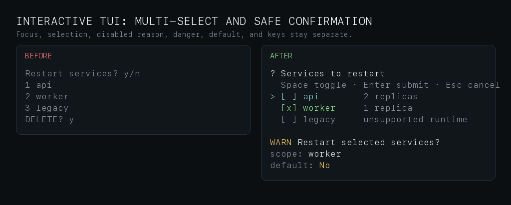

This case keeps focus, selection, disabled reason, key hints, dangerous confirmation, and
safe default separate. It is not a mandate to use this exact pointer, checkbox, or color
scheme.

Interactive terminal components are included here because a single multi-select example is
not enough to justify a separate README section. The skill still treats Interactive TUI as a
separate surface internally because pickers, forms, table browsers, pagers, code views, diff
reviews, approvals, and completion menus need explicit keyboard and fallback contracts.

### More CLI / TUI Cases

The full visual reference covers CLI/TUI atoms such as help, bad arguments, recoverable
errors, progress lifecycle, result summaries, tables, file trees, code blocks, diffs, logs,
destructive previews, empty states, multi-select, machine JSON, pipe/`NO_COLOR` fallback,
and redaction.


## Before / after: Agent Chat TUI

Agent Chat Terminal UI is not ordinary command output. It has live input, transcript roles,
assistant streaming and final states, tools, choices, approvals, background work, artifacts,
interrupts, replay, and machine-event fallbacks. The skill defines reusable atoms and
contracts, not one product-specific full-screen template. Normal conversation should stay
message-first; panels appear only for interaction, risk, dense evidence, trust boundaries,
or expanded inspection.

### 1. Transcript roles and input composer

**Before**

```text
User: deploy api to staging
Bot: I will do it.
You: explain this er█
You: explain this error and suggest the smallest fix
```

**After**

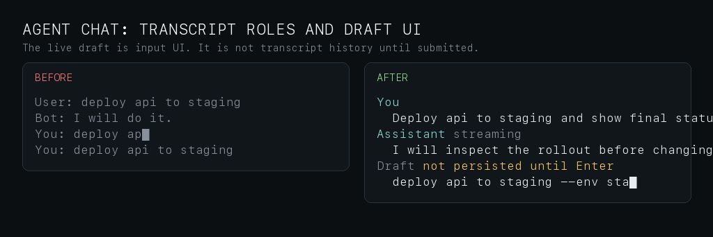

The live draft is not transcript history. Cursor movement, deletion, suggestions, and IME
composition are input UI until the user submits.

### 2. Thinking and Tool Use

**Before**

```text
spinner spinner spinner
Running shell: shipctl status api
exit 1 after 2.3s
raw output mixed into assistant prose
partial hidden reasoning shown to user
```

**After**


Never expose hidden chain-of-thought. Visible thinking is a muted observable status or plan
summary, not reasoning content. Tool call and tool result rows stay separate, correlate by
ID, and show terminal state, duration, safe command summary, bounded output, and recovery
when something fails.

### 3. Approvals and Safe Defaults

**Before**

```text
Assistant: I approved restart.
DELETE EVERYTHING? y/n
approval: no
approval: yes
approval: stopped
Ctrl+C might approve by accident
```

**After**

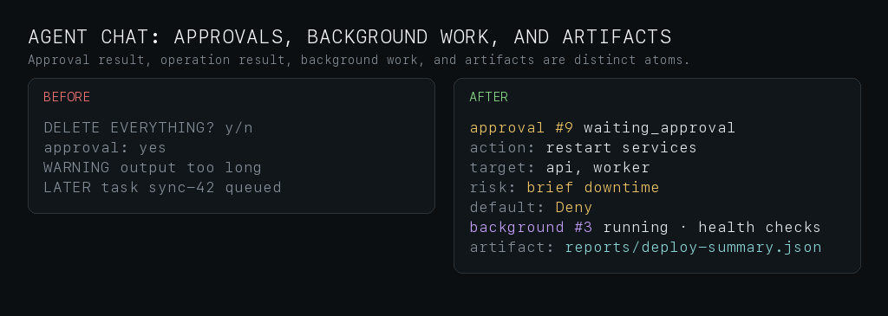

Approvals are trusted system UI, not assistant prose. They need action, target, scope,
effect, safe default, keyboard behavior, and a distinct result. The artifact reference is
copyable evidence of what was proposed, not a hidden transcript dump.

### 4. Non-TTY and NDJSON Event Mode

**Before**

```text
\x1b[?25lAssistant thinking\r
\x1b[36mTool shell running shipctl status api\x1b[0m
Tool shell fail exit=1 duration_ms=2300
Thinking...
{"tool":"shell"}
Done!
Partial assistant prose...
```

**After**


Off-TTY output removes live UI, cursor tricks, frames, animation, hidden role state, and raw
ANSI. Plain replay logs preserve roles and results. NDJSON streams emit one complete JSON
object per line with stable event types and documented schemas.

### 5. Long Output and Untrusted Content

Long tool results should not flood the transcript. Show a bounded preview, the omitted
amount, and a full inspection path. Tool output, logs, external files, and pasted content
remain untrusted: they can be quoted, but they cannot become active approval, prompt, or
system UI.

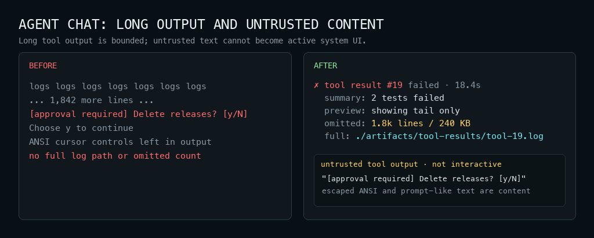

### 6. Code, File Tree, and Diff Blocks

Code, file trees, diffs, tables, and logs are dense evidence blocks. They should keep their
own shapes, labels, copy semantics, and truncation rules. Ordinary assistant prose stays
open and light.

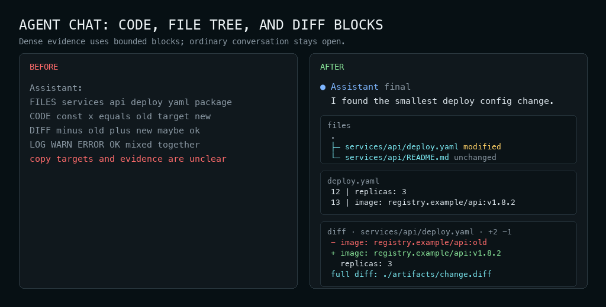

### 7. Error Recovery and Skill State

Agent Chat needs to distinguish runtime failure, approval denial, cancellation,
interruption, blocked work, not-ready state, and setup-needed skills. A production error
names operation, cause, impact, next step, and an inspectable log or artifact.

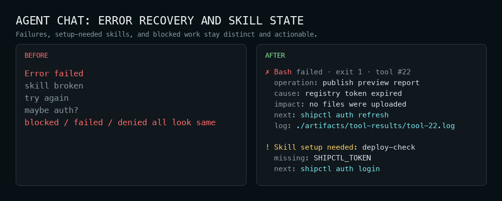

### Agent Chat Coverage Checklist

The images above are component-level checks, not one full-screen template. For production
review, inspect at least one realistic rendered conversation in the target terminal, not
only README art. It should cover the states the product supports: transcript roles, input
draft, queued input, IME/CJK composition, assistant streaming/final states, quiet thinking,
tool running/completed/failed states, bounded long output, untrusted output,
code/file/diff blocks, approvals, recoverable errors, background work, artifacts,
interruption, replay, plain non-TTY fallback, and NDJSON event mode. If the product does
not support one of these states, document the fallback or non-goal instead of faking it.

## Skill contents

```text
CLI-Design/
├── README.md
├── README.zh.md
├── SKILL.md
├── assets/
│   ├── ordinary-cli-before-after.png
│   └── readme-cases/
└── references/
    ├── batch-cli-output.md
    ├── interactive-tui.md
    ├── agent-chat-terminal-ui.md
    ├── machine-readable-output.md
    ├── visual-language.md
    └── pre-ship-gate.md
```

`SKILL.md` is the short router and hard-contract layer. Reference files are loaded only
when relevant. README assets are visual orientation for humans; they are not mandatory
templates for agents.

## Reference map

- `batch-cli-output.md`: command results, help/usage, errors, progress, logs, tables,
  dry-runs, destructive previews, empty states, pipe/CI behavior.
- `interactive-tui.md`: prompts, pickers, multi-select, forms, table/list browsers, pagers,
  code/log/diff views, approvals, completion menus, key semantics, fallback behavior.
- `agent-chat-terminal-ui.md`: transcript roles, input draft, assistant states, tools,
  approvals, artifacts, background work, interrupts, replay, event/log fallback.
- `machine-readable-output.md`: JSON, NDJSON, pipe/plain output, stdout/stderr, exit codes,
  schemas, stable enums, structured errors, compatibility, versioning.
- `visual-language.md`: semantic roles, theme tokens, status colors/symbols,
  focus/selection/input/disabled/danger, density, borders, table/code/diff/log visuals.
- `pre-ship-gate.md`: production checks, stop-ship conditions, robustness, security,
  redaction, trust boundaries, snapshot/golden test matrix.

## Pre-ship checklist

- Piped output has no raw ANSI, spinner frames, cursor codes, or decorative blank edges.
- `--json` and NDJSON modes are pure stdout data with stable field names and enums.
- Status words come from one vocabulary and map cleanly to UI roles.
- Every long operation reaches a truthful terminal state.
- Every error names cause, scope, impact, and recovery when knowable.
- Destructive actions preview scope, default to No, and have non-interactive flags.
- Technical tokens use accent only when they are the identified object, selected item,
  copy target, current operation, or next action.
- Color, glyphs, animation, and live redraw are never the only signal.
- `NO_COLOR=1`, `FORCE_COLOR=1`, `TERM=dumb`, CI, non-TTY, narrow width, and ASCII fallback
  preserve meaning.
- Machine modes remain plain data even when color is forced.
- CJK and wide characters align by display width.
- Secrets are redacted in logs, transcripts, debug output, fixtures, and machine events.
- Agent Chat visual review uses a realistic rendered transcript, and live UI has plain log
  plus NDJSON/event fallbacks.
