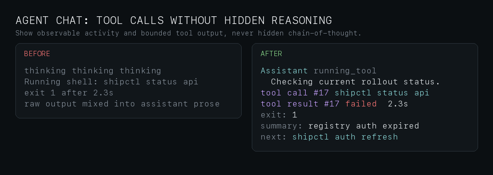
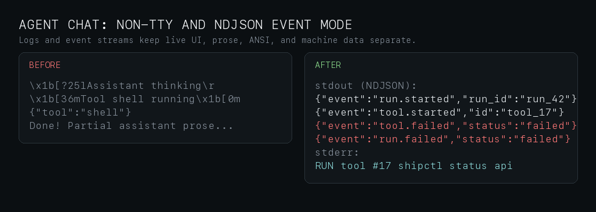

# CLI-Design

> A production-grade agent skill for designing terminal surfaces that are accurate first,
> human-usable second, script/agent-usable third, and visually calm last.

**English** · [中文](./README.zh.md) · Version `2.0.2`

This skill is for terminal surfaces: what a CLI prints, how a TUI behaves, how color and
symbols carry state, how progress and errors recover, how output degrades in pipes and CI,
and how an agent-chat terminal UI renders turns, tools, approvals, choices, artifacts,
background work, and machine events.

It does not design command names, flags, business logic, or low-level terminal input loops.

## Install

```bash
npx skills add Mai8304/skills -s CLI-Design -g -y
```

Manual install:

```bash
git clone https://github.com/Mai8304/skills
cp -r skills/CLI-Design ~/.codex/skills/cli-design
```

Then ask your agent to use `cli-design` when designing, building, reviewing, or improving
CLI and terminal TUI output.

The GitHub project directory is `CLI-Design`. The installed Codex skill name is
`cli-design`, because skill names must be lowercase hyphen-case.

## Default stance

The baseline is strict:

- **terminal surface as protocol**: output is a contract between human, script, and agent
- **semantic over decorative**: color, symbols, spacing, and labels must carry meaning
- **contract before chrome**: decide stdout/stderr, schema, exit code, fallback, and risk first
- **low decoration**: no rainbow output, no default emoji, no frames around ordinary data
- **scriptable first**: `stdout` is data; `stderr` is conversation; `--json` is pure data
- **TTY-aware**: animation, cursor tricks, links, and live redraw are interactive-only
- **theme-safe**: respect light/dark terminals, `NO_COLOR`, CI, `TERM=dumb`, narrow width,
  CJK/wide characters, and ASCII fallback
- **safe by default**: destructive actions preview impact and default to No

There is one explicit exception: **expressive TTY notices**. Low-frequency interactive
notices, such as update notices, may use a light frame, a small icon, and underlined/raw
URLs. They must degrade to plain lines outside an interactive TTY.

## Core decision model

Before choosing color, symbols, layout chrome, or copy, use this order:

```text
reader task -> surface family -> interaction contract -> channel contract -> visual semantics
```

- **Reader task**: discover, inspect, act, recover, automate, or converse.
- **Surface family**: Batch CLI, Interactive TUI, Agent Chat Terminal UI, or
  Machine-readable output.
- **Interaction contract**: passive output, confirmation, single select, multi select,
  approval, interrupt, replay, or live agent session.
- **Channel contract**: TTY, pipe, `--json`, NDJSON, CI, `NO_COLOR`, `TERM=dumb`, width,
  Unicode support, stdout/stderr, and exit code.
- **Visual semantics**: state, focus, selection, disabled reason, danger, next action,
  copy target, secondary information, and body text.

The practical rule is: information structure first, layout second, semantic color third.
Technical tokens such as commands, flags, paths, URLs, environment variables, and config
keys get accent only when they are the identified object, selected item, copy target,
current operation, or next action.

## Four lenses

Every terminal design decision is judged in this order:

1. **Accurate**: never lie about state, progress, counts, risk, cause, or uncertainty.
2. **Human-usable**: show the result, blocker, next action, and recovery path at a glance.
3. **Agent/script-usable**: keep logs, schemas, events, status words, and exit codes stable.
4. **Beautiful**: use calm hierarchy, semantic color, stable symbols, and whitespace.

When these conflict, the earlier lens wins. A pretty layout never justifies a wrong state
or a polluted machine contract.

## What the skill covers

| Area | Coverage |
|---|---|
| Surface routing | Batch CLI, Interactive TUI, Agent Chat Terminal UI, Machine-readable output |
| Batch CLI output | command results, help/usage, argument errors, diagnostics, progress, logs, summaries, tables, dry-runs, destructive previews, pipe/CI behavior |
| Interactive TUI | pickers, multi-select, forms, table/list browsers, pagers, code/log blocks, diffs, approvals, completion menus, live progress |
| Agent Chat Terminal UI | transcript roles, input draft, streaming/final states, tools, approvals, choices, artifacts, interrupts, queues, background work, replay, event fallback |
| Machine-readable output | `--json`, NDJSON, pipe/plain output, stdout/stderr, exit codes, schemas, stable enums, structured errors, versioning |
| Visual language | semantic roles, theme tokens, status colors/symbols, focus/selection/input/disabled/danger, density, borders, table/code/diff/log visuals |
| Runtime robustness | `NO_COLOR`, `FORCE_COLOR`, `TERM=dumb`, CI, non-TTY, narrow width, CJK/wide-character alignment, ASCII fallback, terminal cleanup |
| Safety and trust | destructive confirmation, approval state, redaction, secret handling, audit-friendly tool output, recovery copy |

## Before / after: ordinary CLI

The README shows a few representative cases. The PNG gallery after these examples carries
the broader visual reference. Each representative image is a before/after comparison with
English terminal text. Examples are recipes, not templates: preserve the information
contract and adapt the layout to the CLI in front of you.

### 1. Errors That Guide

**Before**

```text
Error: invalid
Error: failed
```

**After**


An error is not just red text. It must name the operation, cause, affected scope, impact,
and a concrete recovery step when knowable.

### 2. Semantic Color, Progress, and Result State

**Before**

```text
Important: run shipctl auth refresh now
See docs: https://example.com/docs/auth

Uploading release.tgz 3.8/5.1 MB 74% 1.2 MB/s eta 1s
Uploaded release.tgz 5.1 MB in 4.2s
Deploy finished. Some checks failed. Lots of log output...
```

**After**


Use color for semantic state: green for success, yellow for warning or degraded state, red
for current failure, cyan for focus/current/next-action roles. Progress must be honest and
must resolve to a terminal state.

### 3. Data Shapes and Diagnostics

**Before**

```text
+--------+--------------------+--------+
| NUMBER | TITLE              | STATE  |
+--------+--------------------+--------+
| 128    | Fix color fallback | open   |
+--------+--------------------+--------+

ID TITLE AUTHOR BRANCH CHECKS FILES
128 Fix color fallback open zw fix-color->main pass=4 files=6 +128 -34

error E0382 borrow of moved value cfg
src/main.go line 14 column 9
line 12 load(cfg) moved cfg
line 14 print(cfg) used after move
```

**After**


Use tables for homogeneous rows, key-value blocks for one object, and structured diagnostics
for source, cause, evidence, and next action. Alignment must use display width, not byte or
rune count.

### 4. Runtime Contracts and Redaction

**Before**

```text
Checking...
{
  "schema_version": "1",
  "ok": false,
  "duration_ms": 412,
  "checks": [
    {
      "name": "registry_auth",
      "status": "\x1b[31mfail\x1b[0m",
      "message": "not configured",
      "next_steps": [
        { "command": "shipctl auth refresh", "reason": "refresh credentials" }
      ]
    }
  ]
}
Run shipctl auth refresh to fix this!

NAME      STATUS
配置文件      missing
gateway   pass

connected with token sk-live-123456
```

**After**


Machine mode is a contract. It must not mix ANSI, spinner frames, prose wrappers, or
decorative blank lines into stdout. Secrets must be redacted in human output, logs,
transcripts, fixtures, and machine events.

### More CLI / TUI Cases

The full visual reference covers CLI/TUI atoms such as help, bad arguments, recoverable
errors, progress lifecycle, result summaries, tables, destructive previews, empty states,
multi-select, machine JSON, pipe/`NO_COLOR` fallback, and redaction.


## Before / after: Interactive TUI

Interactive terminal components are not just prettier prompts. They must define focus,
selection, input mode, submit, confirm, cancel, disabled state, danger, key hints, fallback,
and terminal cleanup before styling.

### Multi-select and safe confirmation

**Before**

```text
Restart services? y/n
1 api
2 worker
3 legacy
DELETE? y
```

**After**


This case keeps focus, selection, disabled reason, key hints, dangerous confirmation, and
safe default separate. It is not a mandate to use this exact pointer, checkbox, or color
scheme.

## Before / after: Agent Chat TUI

Agent Chat Terminal UI is not ordinary command output. It has live input, transcript roles,
assistant streaming and final states, tools, choices, approvals, background work, artifacts,
interrupts, replay, and machine-event fallbacks. The skill defines reusable atoms and
contracts, not one product-specific full-screen template.

### 1. Transcript roles and input composer

**Before**

```text
User: deploy api to staging
Bot: I will do it.
You: explain this er█
You: explain this error and suggest the smallest fix
```

**After**


The live draft is not transcript history. Cursor movement, deletion, suggestions, and IME
composition are input UI until the user submits.

### 2. Thinking and Tool Use

**Before**

```text
thinking thinking thinking
Running shell: shipctl status api
exit 1 after 2.3s
raw output mixed into assistant prose
partial hidden reasoning shown to user
```

**After**



Never expose hidden chain-of-thought. Show concise observable summaries and bounded tool
results with terminal state, duration, command identity, and evidence links when useful.

### 3. Approvals, Background Work, and Artifacts

**Before**

```text
DELETE EVERYTHING? y/n
approval: no
approval: yes
approval: stopped
approval: changed
WARNING output too long
ERROR command failed exit 2
WAIT retrying in 30 seconds
LATER task sync-42 queued
```

**After**


Approvals are decision atoms. Background tasks need identity, state, owner, timing, and
resume behavior. Large artifacts get summaries and stable references, not full dumps in the
transcript.

### 4. Non-TTY and NDJSON Event Mode

**Before**

```text
\x1b[?25lAssistant thinking\r
\x1b[36mTool shell running shipctl status api\x1b[0m
Tool shell fail exit=1 duration_ms=2300
Thinking...
{"tool":"shell"}
Done!
Partial assistant prose...
```

**After**



Off-TTY output removes live UI, cursor tricks, frames, animation, hidden role state, and raw
ANSI. Machine streams use stable event types and documented schemas.

### More Agent Chat TUI Cases

The full visual reference covers Agent Chat atoms such as transcript roles, input draft,
multiline paste, IME/CJK composition, assistant streaming, tool use, tool results, choices,
approvals, alerts, timers, background tasks, theme adaptation, suggestions, file mentions,
cancellation, approval outcomes, artifacts, plain non-TTY fallback, and NDJSON event mode.


## Skill contents

```text
CLI-Design/
├── README.md
├── README.zh.md
├── SKILL.md
├── assets/
│   ├── ordinary-cli-before-after.png
│   ├── agent-chat-tui-before-after.png
│   └── readme-cases/
└── references/
    ├── batch-cli-output.md
    ├── interactive-tui.md
    ├── agent-chat-terminal-ui.md
    ├── machine-readable-output.md
    ├── visual-language.md
    └── pre-ship-gate.md
```

`SKILL.md` is the short router and hard-contract layer. Reference files are loaded only
when relevant. README assets are visual orientation for humans; they are not mandatory
templates for agents.

## Reference map

- `batch-cli-output.md`: command results, help/usage, errors, progress, logs, tables,
  dry-runs, destructive previews, empty states, pipe/CI behavior.
- `interactive-tui.md`: prompts, pickers, multi-select, forms, table/list browsers, pagers,
  code/log/diff views, approvals, completion menus, key semantics, fallback behavior.
- `agent-chat-terminal-ui.md`: transcript roles, input draft, assistant states, tools,
  approvals, artifacts, background work, interrupts, replay, event/log fallback.
- `machine-readable-output.md`: JSON, NDJSON, pipe/plain output, stdout/stderr, exit codes,
  schemas, stable enums, structured errors, compatibility, versioning.
- `visual-language.md`: semantic roles, theme tokens, status colors/symbols,
  focus/selection/input/disabled/danger, density, borders, table/code/diff/log visuals.
- `pre-ship-gate.md`: production checks, stop-ship conditions, robustness, security,
  redaction, trust boundaries, snapshot/golden test matrix.

## Pre-ship checklist

- Piped output has no raw ANSI, spinner frames, cursor codes, or decorative blank edges.
- `--json` and NDJSON modes are pure stdout data with stable field names and enums.
- Status words come from one vocabulary and map cleanly to UI roles.
- Every long operation reaches a truthful terminal state.
- Every error names cause, scope, impact, and recovery when knowable.
- Destructive actions preview scope, default to No, and have non-interactive flags.
- Technical tokens use accent only when they are the identified object, selected item,
  copy target, current operation, or next action.
- Color, glyphs, animation, and live redraw are never the only signal.
- `NO_COLOR=1`, `FORCE_COLOR=1`, `TERM=dumb`, CI, non-TTY, narrow width, and ASCII fallback
  preserve meaning.
- Machine modes remain plain data even when color is forced.
- CJK and wide characters align by display width.
- Secrets are redacted in logs, transcripts, debug output, fixtures, and machine events.
- Agent Chat live UI has plain log and NDJSON/event fallbacks.
