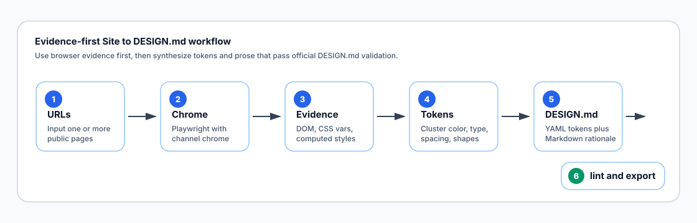
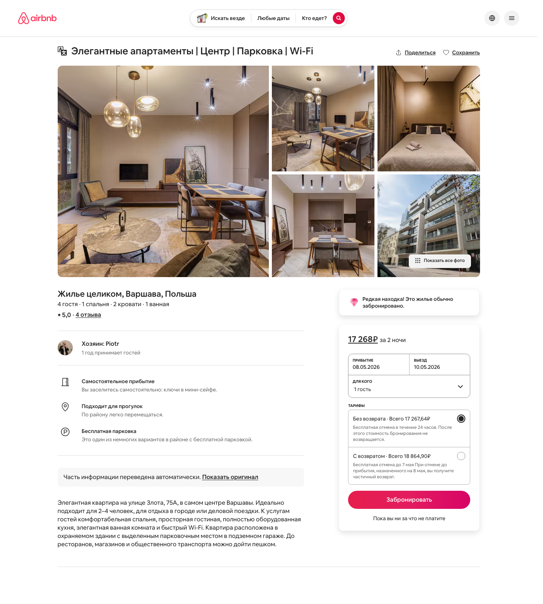
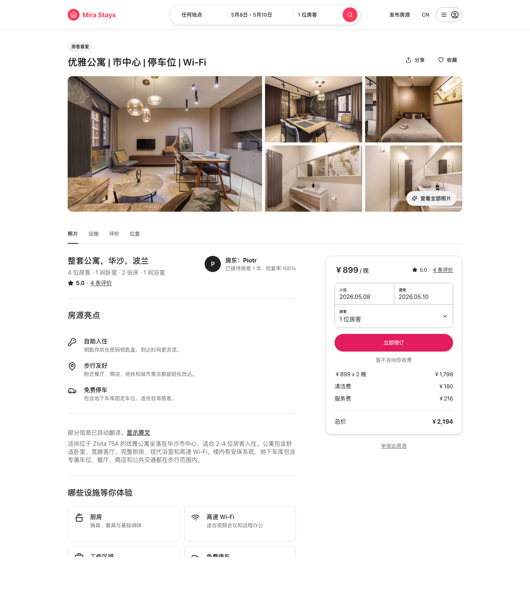

# Site to DESIGN.md

**Language / 语言:** [中文](./README.md) | English

Generate a Google `DESIGN.md` from one or more public website URLs. The workflow does not ask a model to guess a design system from a URL alone. It first captures real browser evidence, then distills colors, typography, spacing, radii, shadows, and component patterns into a validated, exportable `DESIGN.md`.

The default browser is your local Chrome installation:

```js
channel: "chrome"
```

## Workflow



This workflow is built for ordinary public websites. It captures desktop and mobile pages, extracts DOM, computed styles, CSS variables, screenshots, and component candidates, then synthesizes them into a Google `DESIGN.md` design system document.

## How to Use

### 1. Install

Install this directory from GitHub:

```bash
python3 ~/.codex/skills/.system/skill-installer/scripts/install-skill-from-github.py \
  --url https://github.com/Mai8304/skills/tree/main/site-to-design
```

Restart your agent environment after installation so the new capability can be discovered.

### 2. Generate DESIGN.md

Use one website URL:

```text
Use $site-to-design to generate a Google DESIGN.md from https://example.com
```

For a more complete design system, provide multiple representative pages:

```text
Use $site-to-design to generate DESIGN.md from:
- https://example.com/
- https://example.com/pricing
- https://example.com/product
```

Good inputs include home pages, product pages, pricing pages, login pages, listing pages, detail pages, forms, and brand content pages.

### 3. Optional: Capture Browser Evidence Only

If you only want the raw evidence first, run the extraction script directly:

```bash
npm install --save-dev @playwright/test --ignore-scripts

node ~/.codex/skills/site-to-design/scripts/extract-url-design-evidence.js \
  --out .design-md-evidence \
  https://example.com
```

The output directory contains `evidence.json` and screenshots. Chrome is used by default. Override `--channel` only when you explicitly need another Chromium channel:

```bash
node ~/.codex/skills/site-to-design/scripts/extract-url-design-evidence.js \
  --channel chrome-beta \
  https://example.com
```

## Default Output

The default deliverable is a single `DESIGN.md` file containing:

- YAML front matter with machine-readable design tokens.
- Markdown rationale for style, usage rules, and design decisions.
- Color, typography, spacing, radius, and component tokens.
- A distinction between confirmed browser evidence and inferred design interpretation.

Screenshots, HTML snapshots, and `evidence.json` are intermediate evidence artifacts. They are usually not surfaced unless review or debugging is needed.

## Validation

Every generated `DESIGN.md` should pass the official tools:

```bash
npx @google/design.md lint DESIGN.md --format=json
npx @google/design.md export --format tailwind DESIGN.md >/tmp/design-md-tailwind.json
npx @google/design.md export --format dtcg DESIGN.md >/tmp/design-md-dtcg.json
```

If a real brand color triggers a contrast warning, do not alter the color just to silence the warning. Extraction should preserve the real value and record the warning as an accessibility risk when relevant.

## What the Workflow Extracts

- CSS variables and token clues already present in the page.
- Colors, typography, spacing, radii, and shadows from computed styles.
- Desktop and mobile responsive states.
- Component candidates such as navigation, buttons, cards, forms, badges, media grids, footers, and modals.
- Repeated patterns that can be promoted into `DESIGN.md` tokens.

## Result Comparison

The comparison below uses the same Airbnb page material: the left screenshot is the original Airbnb page, and the right screenshot is a page redesigned from the generated `DESIGN.md`.

| Airbnb Original | Website Screenshot Designed from DESIGN.md |
|---|---|
|  |  |
