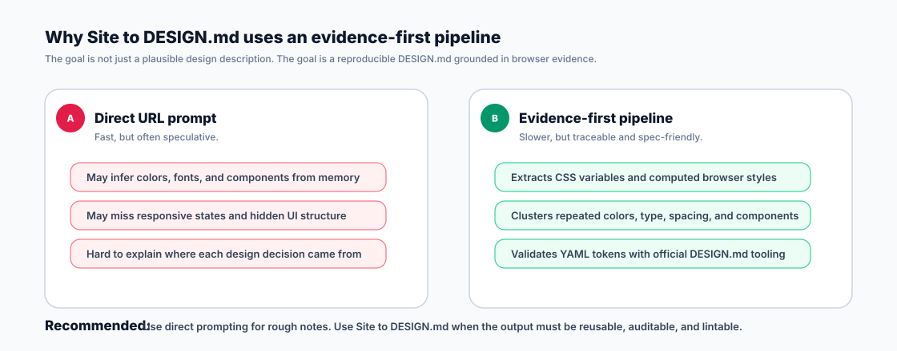

# Site to DESIGN.md

Generate a Google `DESIGN.md` from one or more public website URLs using browser evidence instead of guesswork.

The pipeline opens the site with Playwright using local Chrome by default, extracts DOM structure, CSS variables, computed styles, screenshots, typography, colors, spacing, radii, shadows, and component candidates, then synthesizes a spec-friendly `DESIGN.md`.


## How to use

### 1. Install

Install this directory as a skill from GitHub:

```bash
python3 ~/.codex/skills/.system/skill-installer/scripts/install-skill-from-github.py \
  --url https://github.com/Mai8304/skills/tree/main/site-to-design
```

Restart your agent environment after installation so the new skill is discovered.

### 2. Run on a website

Use the skill with one or more URLs:

```text
Use $site-to-design to generate a Google DESIGN.md from https://example.com
```

For a deeper extraction, provide several representative URLs:

```text
Use $site-to-design to generate DESIGN.md from:
- https://example.com/
- https://example.com/pricing
- https://example.com/product
```

### 3. Optional direct evidence extraction

The bundled script can collect raw browser evidence before synthesis:

```bash
npm install --save-dev @playwright/test --ignore-scripts

node ~/.codex/skills/site-to-design/scripts/extract-url-design-evidence.js \
  --out .design-md-evidence \
  https://example.com
```

Chrome is the default browser channel:

```js
channel: "chrome"
```

Override it only when you intentionally want another Chromium channel:

```bash
node ~/.codex/skills/site-to-design/scripts/extract-url-design-evidence.js \
  --channel chrome-beta \
  https://example.com
```

## Expected output

The normal output is a single `DESIGN.md` file with:

- YAML front matter for machine-readable tokens.
- Markdown sections for design rationale and usage guidance.
- Colors, typography, spacing, radii, and component tokens.
- Notes that separate confirmed browser evidence from inferred design interpretation.

Evidence files such as screenshots and `evidence.json` are implementation artifacts. Keep them private unless review or debugging requires them.

## Validation

Validate every generated `DESIGN.md` with the official package:

```bash
npx @google/design.md lint DESIGN.md --format=json
npx @google/design.md export --format tailwind DESIGN.md >/tmp/design-md-tailwind.json
npx @google/design.md export --format dtcg DESIGN.md >/tmp/design-md-dtcg.json
```

Keep extracted brand colors even when contrast warnings appear. A warning is useful feedback, not a reason to rewrite the brand.

## What the workflow extracts

- CSS variables and design token hints.
- Computed color, font, spacing, radius, and shadow values.
- Desktop and mobile responsive states.
- Navigation, buttons, cards, forms, badges, media grids, footer, and modal candidates.
- Repeated patterns that can be promoted into reusable `DESIGN.md` tokens.

## Comparison



Direct URL prompting can produce a plausible design summary, but it may mix observed facts with memory or inference. Site to DESIGN.md is slower because it collects browser evidence first, but the result is easier to validate, export, and maintain.
